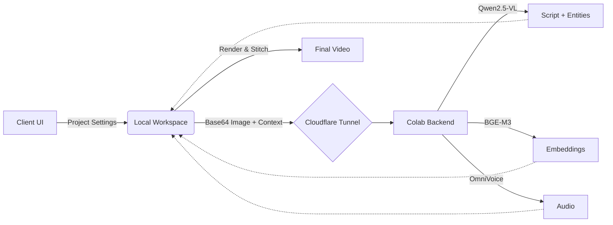

# Xrexze — ManhwaExplainerStudio (Phase 2)

An automated Manhwa/Manga narrative explainer video generator built on PyQt6 and FastAPI, bridging local low-spec hardware (Intel i3, 8GB RAM) with remote Colab T4 GPUs via Cloudflare tunnels. 

## Features
- **Project-Based Workspace:** Segregate logic with `projects/` structure for clean handling of 100+ chapter manhuas.
- **Automated GPU Backend:** Runs Qwen2.5-VL-7B (4-bit), OmniVoice, and BAAI/bge-m3 on a free Colab instance.
- **3-Pillar Context Memory Engine:** 
  - **RAG Engine:** 1024-dim dense vectors cached to Google Drive via FAISS.
  - **Knowledge Graph:** SQLite entity state tracking.
  - **Recursive Summarizer:** Core-lore compression.
- **PDF Ingestion:** High-res PyMuPDF slicing.
- **Tunnel-First Architecture:** Bypasses Playwright iframe limitations with persistent Playwright session cookies.

## Installation

### Local Client (Windows)
1. Install Python 3.11+.
2. Install dependencies:
   ```bash
   pip install -r requirements.txt
   ```
3. Install Playwright browsers (for the Colab bridge):
   ```bash
   playwright install chromium
   ```
4. Install FFmpeg:
   ```bash
   winget install FFmpeg
   ```

### Backend (Google Colab)
1. Upload `colab/colab_server.py` to a new Google Colab notebook, or copy its contents into a cell.
2. Select **Runtime → Change runtime type → T4 GPU**.
3. Run the cell. The server will install dependencies, mount Google Drive, and provide a Cloudflare Tunnel URL.
4. Copy the `.trycloudflare.com` URL.

## Usage
1. Launch the local client:
   ```bash
   python main.py
   ```
2. Create or open a Project.
3. Drop a `.pdf` or a folder of images into the Ingestion Panel.
4. Paste the Colab Tunnel URL or the Notebook URL and click "Start Server".
5. Click **START PIPELINE**.

## Architecture Flow

